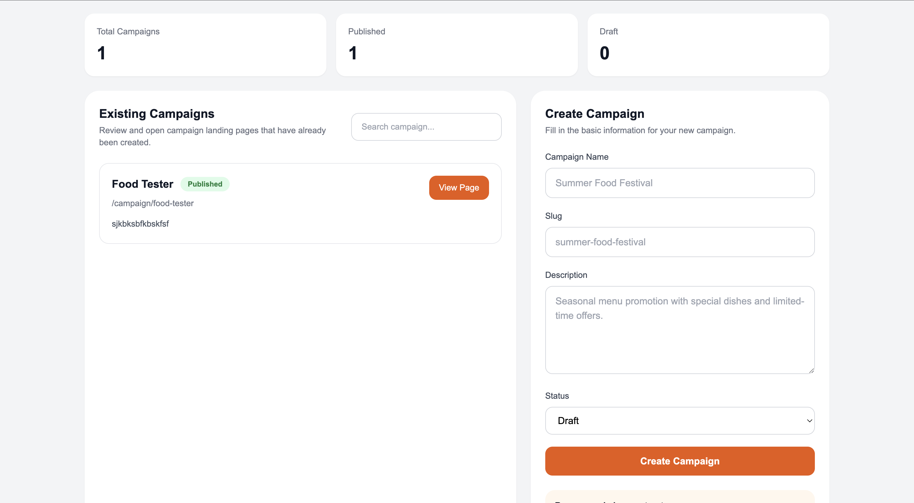
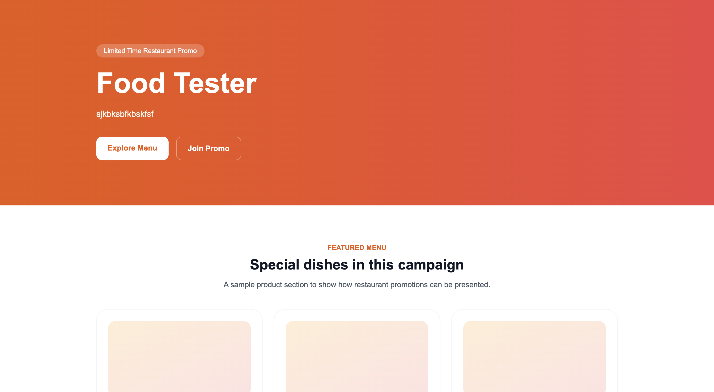
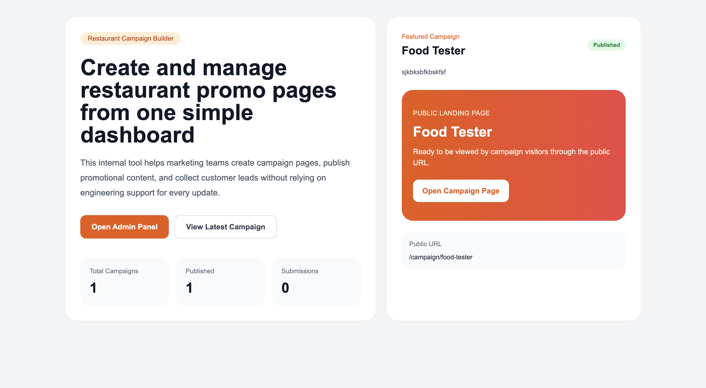

# Restaurant Campaign Landing Page Builder

This project is a simple full stack application built for a campaign management scenario in the restaurant industry. The main goal is to help a marketing team create and manage promotional campaign pages without relying on developers for every update.

## Overview

The system is divided into two main areas:

1. **Admin Panel**  
   Used by the marketing team to create campaigns, review existing campaigns, and monitor form submissions.

2. **Public Campaign Page**  
   Used by visitors to access a campaign page through a public URL.

Example route:

`/campaign/summer-food-festival`

## Product Thinking

Restaurants often run promotions such as seasonal menu launches, special event packages, limited-time discounts, or awareness campaigns for new products. In many cases, the marketing team needs to move quickly, but publishing a dedicated landing page still depends on engineering support.

This creates a bottleneck. Even for simple campaigns, the process becomes slower because each new page needs technical implementation before it can go live.

This project is designed to reduce that dependency by providing a lightweight internal tool. Through the admin panel, the marketing team can create campaign data, manage campaign visibility, and access campaign links more easily. On the public side, visitors can open a campaign page and submit their contact information through a form.

From a business perspective, the system helps in two ways. First, it makes campaign execution faster. Second, it supports lead collection by storing customer submissions in the database.

## Current Features

### 1. Campaign Creation
Admin users can create a campaign with the following fields:
- Campaign Name
- Slug
- Description
- Status

### 2. Campaign List in Admin Panel
The admin panel also provides a campaign list so users can quickly review campaigns that have already been created and open their public pages without needing to manually type a slug.

### 3. Public Campaign Page
Each campaign can be opened using:

`/campaign/{slug}`

The page displays campaign information and serves as the main public landing page for visitors.

### 4. Form Submission
Visitors can submit:
- Name
- Email
- Phone

Submission data is stored in the database and can be viewed in the admin panel.

### 5. Submission Monitoring
Admin users can access a submissions page to review incoming form entries from campaign visitors.

## Technical Architecture

This project uses a compact full stack architecture:

- **Frontend:** Next.js
- **Backend:** Next.js API Routes
- **Database:** SQLite
- **ORM:** Prisma

The stack was chosen for practicality. Since the assignment is expected to run locally and does not require deployment, Next.js API Routes and SQLite provide a simple setup with minimal overhead.

Architecture flow:

`Frontend UI -> API Routes -> Prisma ORM -> SQLite Database`

This approach keeps the application easy to run, easy to review, and suitable for the assignment scope.

## Data Modeling

The application uses the following main entities:

### Campaign
Stores the core information for each campaign.
- id
- name
- slug
- description
- status

### Section
Planned as the structure for campaign page sections such as hero, product, and form content.  
For local development with SQLite, section content can be stored as serialized JSON in a string field.

### Submission
Stores visitor form submissions.
- id
- name
- email
- phone
- campaignId
- createdAt

This structure is enough for the current scope and keeps campaign and submission relationships clear.

## Notes on Implementation Scope

The current implementation focuses on the main campaign flow:
- creating campaigns
- listing campaigns in the admin panel
- opening campaign pages by slug
- saving form submissions
- viewing submissions in the admin panel

The section-based landing page builder is part of the intended design and data model, but the current submission prioritizes the core campaign flow and clean local setup.

## Scalability Considerations

If this project needed to support a larger number of campaigns and higher traffic, several improvements could be introduced.

First, the database should be migrated from SQLite to PostgreSQL for better reliability and concurrency support.

Second, campaign content could be modeled in a more structured way if the section builder becomes more advanced.

Third, published campaign pages could use caching or static generation to reduce repeated server-side work.

Finally, the admin panel and public application could be separated into different services if the product grows beyond a simple internal tool.

## Local Setup

Install dependencies:

```bash
npm install


```md
## Screenshots

### Admin Campaign Page


### Public Campaign Page


### Submissions Page
